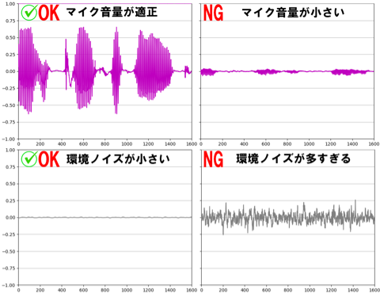

# ゆかりねっと用のFaster-Whisper音声認識エンジン
AI認識のFaster-Whisperをゆかりねっとや、ゆかコネNEOで使うための音声認識エンジンです。

# Features
* google認識に頼らない音声認識が出来ます。
* 1.1GBほどビデオメモリを消費します。
* googleより少し認識速度が速いです(RTX3080Ti基準)  
  
* nVIDIA系GPU(1000番以降)で動作します。 Driverは572.83以降(Cuda12.8)必須
  

# Installation
* 実行にはpythonのインストールが必要です。  https://www.google.com/search?q=PythonインストールWindows  
  python3.9以上で動作します。推奨は [`3.13.9です`](https://www.python.org/downloads/release/python-3139/)  
  pythonのパスを追加にチェックを入れてインストールしてください。  
  

### v0.0.5以前からバージョンアップの方
  * [変更点はこちら](https://github.com/tyapa0/YukariWhisper/releases)
  * v0.0.5以前からは互換性が無いので、旧フォルダを削除してください。
  * `初めてのかた`を見て新規インストールをしてください。
  * `yukariwhisper.ini`は古いものを使わないでください！！(互換性なし)
  
### 初めてのかた
  *  Source code (zip) をDownLoadします。 https://github.com/tyapa0/YukariWhisper/archive/refs/tags/v0.1.1.zip
  * `YukariWhisper-0.x.x.zip`を任意のフォルダへ解凍します。  
     ※解凍ツールによってはセキュリティ許可がされていない場合があります。  
   ファイルを右クリック→プロパティで表示し、セキュリティを許可してください。  
      
  * フォルダ内にある自動インストーラー`setup.bat`を実行します。
  * 数十分かかります。「続行するには何かキーを押してください . . .」と出れば終了です。
  * `run.bat`を実行します。
  * 初回のみダウンロードが始まります。しばらくするとマイク選択が出ます。
  * マイクの番号を入力してEnterキーを押してください。
### venv等 設定済みの方(分かる人用)  
  * gitで本プロジェクトをcloneしてmain.pyを実行してください。
  * `YukariWhisper`フォルダ内に`requirements.txt`があります。
  * AMD環境の方はLinux環境上で手動で構築できる人なら動かせますが、[制約が多いです。 ](https://rocm.docs.amd.com/en/docs-5.7.1/release/gpu_os_support.html)  

# Settings
* `yukariwhisper.ini`を書き換えてください。  

* **text_type = 0**  
送信する文字形式を指定します。  
ゆかりねっとを使う場合=0  
ゆかコネNEOを使う場合=1  

* **local_port = 50000**  
ゆかりねっとの設定にある。「音声認識エンジン」の「認識結果待ち受けポート」と番号を同じにしてください。  
  
ゆかコネNEOの場合は、「︙」三点アイコンの動作状況にあるCommunicationPortのWebSocket(NEO-innerAPI):  の値と同じにしてください  
  

* 下記2つのパラメータは使用状況に応じて調整してください。  
* **pause_threshold = 5**  
フレーズの終わりとして認識される無音の最小の長さ (0.1秒単位)を指定します。値が小さいほど認識はより速く完了しますが、発声の途中で切れるなどのぶつ切りになりやすくなります。
* **phrase_threshold = 10**  
発話音声をフレーズとみなすまでの発話音声の最小秒数(0.1秒単位)を指定します。「はい」等の短いフレーズを認識させたい場合は短くしてみてください。短くするとあくびや鼻をすする音などでハルシネーション(誤認識)が出やすくなります。

* その他オプションはyukariwhisper.ini内を見てください。  

# Q&A
* 動かない！  
 エラー画面をキャプチャして[issues](https://github.com/tyapa0/YukariWhisper/issues)へ投稿、もしくは[Xへリプライ](https://twitter.com/TYA_PA_)をしていただければ確認します。  

* マイクが認識しない？  
 音声のリアルタイムプロットの波形が紫になっているか確認してください。  
 マイクの入力や音量がちょうど良くなるように調節してください。  
   

* マウスやJoyStickの音を拾ってブブブブブブブブ等の文字が大量に出る。
  1. まずはマイクの音量を認識ギリギリまで絞ってみてください。
  1. [NVIDIA Broadcastアプリ](https://www.nvidia.com/ja-jp/geforce/broadcasting/broadcast-app/)等のノイズキャンセル技術を検討してみてください。  
  1. `yukariwhisper.ini`の vad_threshold=0.5など、少し大きくしてみてください。
  1. `ngwords.txt`に入れたキーワードを含む言葉は無視されます。5～8文字程度入れてみてください。  
  NVIDIA Broadcastアプリをインストールした後、マイク選択はNVIDIA Broadcastを選択してください。  
    

* 起動時にDLしたモデルはどこ？  
  **C:\\Users\\ユーザー名\\.cache\\huggingface\\hub** に入っています。完全アンインストールする場合はその中でにある models--Systran--faster-whisper-large-v3 や models--kotoba-tech--kotoba-whisper-v1.0-faster などを削除してください。他にもAI系のソフトを使っていると、何かしらファイルがあるので必要なものは残してください。

# Planned Features
* ~~デバイスリストの文字化けを修正する(python-sounddeviceへ変更)~~  
* ~~区切り検出をspeech_recognitionからSilero VADへ完全移行する  
  参考：https://github.com/jianfch/stable-ts~~
* ~~pyqtgraphで音声のリアルタイムプロットを表示する  
  音声認識中かそうで無いかをインジケータ表示で分かりやすくする  
  定常ノイズを可視化しユーザーに認識させる~~  
* ~~Kotoba-Whisperの評価 (distil-whisper)  
  参考：[https://github.com/huggingface/distil-whisper/tree/main/training](https://huggingface.co/kotoba-tech/kotoba-whisper-v1.0)~~　　

# License
"YukariWhisper" is under [MIT license](https://en.wikipedia.org/wiki/MIT_License).

