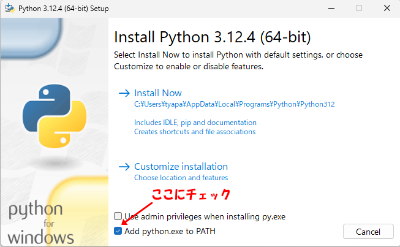

# ゆかりねっと用のFaster-Whisper音声認識エンジン
AI認識のFaster-Whisperをゆかりねっとや、ゆかコネNEOで使うための音声認識エンジンです。

# Features
* google認識に頼らない音声認識が出来ます。
* 1.7GBほどビデオメモリを消費します。
* googleより少し認識速度が速いです(RTX3080Ti基準)  
  
* nVIDIA系GPU(1000番以降)で動作します。  
  

# Installation
* 実行にはpythonのインストールが必要です。  https://www.google.com/search?q=PythonインストールWindows  
  python3.9以上で動作します。推奨は [`3.11.8です`](https://www.python.org/downloads/release/python-3118/)  
  `python3.12では動きません！！`(20024/03/09現在)  
  pythonのパスを追加にチェックを入れてインストールしてください。  
  

### v0.0.1以降バージョンアップの方
  * [変更点はこちら](https://github.com/tyapa0/YukariWhisper/releases)
  * Source code (zip) をDownLoadします。 https://github.com/tyapa0/YukariWhisper/archive/refs/tags/v0.0.5.zip
  * `YukariWhisper-0.x.x.zip`を任意のフォルダへ解凍します。  
  *  `ngwords.txt`以外のファイルを既にインストール済みのフォルダへ上書きしてください
  * `yukariwhisper.ini`は追加項目があるので、上書きした後で数値を設定し直してください。
  * `run.bat`を実行します。

### 初めてのかた
  *  Source code (zip) をDownLoadします。 https://github.com/tyapa0/YukariWhisper/archive/refs/tags/v0.0.5.zip
  * `YukariWhisper-0.x.x.zip`を任意のフォルダへ解凍します。  
     ※解凍ツールによってはセキュリティ許可がされていない場合があります。  
   ファイルを右クリック→プロパティで表示し、セキュリティを許可してください。  
      
  * フォルダ内にある自動インストーラー`setup.bat`を実行します。
  * 数十分かかります。「続行するには何かキーを押してください . . .」と出れば終了です。
  * `run.bat`を実行します。
  * 初回のみダウンロードが始まります。しばらくするとマイク選択が出ます。
  * マイクの番号を入力してEnterキーを押してください。
### venv等 設定済みの方(分かる人用)  
  * gitで本プロジェクトをcloneしてmain.pyを実行してください。
  * `YukariWhisper`フォルダ内に`requirements.txt`があります。
  * AMD環境の方はLinux環境上で手動で構築できる人なら動かせますが、[制約が多いです。 ](https://rocm.docs.amd.com/en/docs-5.7.1/release/gpu_os_support.html)  

# Settings
* `yukariwhisper.ini`を書き換えてください。  

* **text_type = 0**  
送信する文字形式を指定します。  
ゆかりねっとを使う場合=0  
ゆかコネNEOを使う場合=1  

* **local_port = 50000**  
ゆかりねっとの設定にある。「音声認識エンジン」の「認識結果待ち受けポート」と番号を同じにしてください。  
  
ゆかコネNEOの場合は、「︙」三点アイコンの動作状況にあるCommunicationPortのWebSocket(NEO-innerAPI):  の値と同じにしてください  
  

* その他オプションはyukariwhisper.ini内を見てください。  
  音の切れ目を認識にしくいときは、PCのファンノイズを拾っている可能性があります。  
  従来の半分程度の音量でも認識するので、入力を半分に以下にするなど試してみてください。  
  iniファイルはQuest2でのVirtualDesktop基準で設定されています。マイクの推奨値は40%です。  
  

# Q&A
* 動かない！  
 エラー画面をキャプチャして[issues](https://github.com/tyapa0/YukariWhisper/issues)へ投稿、もしくは[Xへリプライ](https://twitter.com/TYA_PA_)をしていただければ確認します。  

* マウスやJoyStickの音を拾ってブブブブブブブブ等の文字が大量に出る。
  1. まずはマイクの音量を認識ギリギリまで絞ってみてください。
  1. [NVIDIA Broadcastアプリ](https://www.nvidia.com/ja-jp/geforce/broadcasting/broadcast-app/)等のノイズキャンセル技術を検討してみてください。  
  1. `yukariwhisper.ini`の vad_threshold=0.5など、少し大きくしてみてください。
  1. `ngwords.txt`に入れたキーワードを含む言葉は無視されます。5～8文字程度入れてみてください。  
  NVIDIA Broadcastアプリをインストールした後、マイク選択はNVIDIA Broadcastを選択してください。  
    
  vad_thresholdは=0.1等少なめでも問題なくなります。  
  ダイナミックマイクを使っている方は dynamic_energy_ratio=2.0など、少し少な目がちょうどいい値になります。  

# Planned Features
* デバイスリストの文字化けを修正する(python-sounddeviceへ変更)  
* 区切り検出をspeech_recognitionからSilero VADへ完全移行する  
  参考：https://github.com/jianfch/stable-ts
* pyqtgraphで音声のリアルタイムプロットを表示する  
  音声認識中かそうで無いかをインジケータ表示で分かりやすくする  
  定常ノイズを可視化しユーザーに認識させる  
* Kotoba-Whisperの評価 (distil-whisper)
  参考：[https://github.com/huggingface/distil-whisper/tree/main/training](https://huggingface.co/kotoba-tech/kotoba-whisper-v1.0)

# License
"YukariWhisper" is under [MIT license](https://en.wikipedia.org/wiki/MIT_License).

